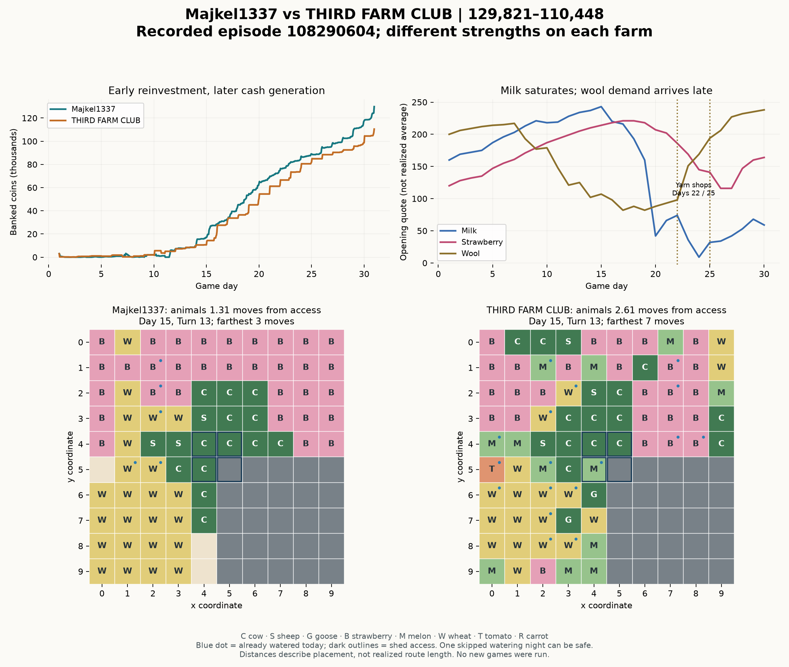

# Majkel versus THIRD FARM CLUB: adaptive portfolios, execution and shared supply

Episode **108290604** ends **129,821–110,448**, a **19,373-coin win** for
Majkel1337 (seat 0). Both players finish DONE. This review inspects all 720
recorded states and 719 joint decisions, then compares three previously supplied
Majkel games. No engine, local game, counterfactual season or policy evaluation
was run. UI dates are one-based; grid coordinates are zero-based.

[Structured evidence](benchmarks/majkel-108290604-study.json) includes source
hashes, confirmed acquisitions, planting counts, both visible portfolios by day,
mechanical demand, quotes, service records and sale requests. Requests are not
assumed to fill. Exact algorithm, forecast and submission-version identity are
not recoverable from these replays. The user's current-rank description is not
independently verified here.

## 1. A repeatable opening followed by a changing portfolio

The first two market-order lists are identical across all four games: one cow
and five wheat, followed by a one-wheat sale, four hires, another cow and three
sheep. Each game establishes twelve melons as six plants on Day 1, four on Day 2
and two on Day 3. The first land purchase is always **Day 7 Turn 6**. These are
strong signs of a common structured opening, even though unknown source updates
between games cannot be excluded.

The later investments are materially different:

| Majkel match | First two shops | Cows / sheep / geese bought | Strawberries planted | Tomatoes / carrots planted | Final coins |
|---|---|---:|---:|---:|---:|
| THIRD FARM CLUB, 108290604 | Smoothie, ice cream | **13 / 3 / 0** | **33** | **7 / 54** | 129,821 |
| M & M & P & Q, 108305451, win | Ice cream, ice cream | **14 / 3 / 0** | **41** | **0 / 0** | 178,462 |
| SpaTaro, 108300532 | Bakery, pet cafe | **7 / 3 / 4** | **25** | **14 / 30** | 90,293 |
| M & M & P & Q, 108295517, loss | Yarn, pizza | **7 / 11 / 0** | **17** | **12 / 24** | 105,196 |

Animal columns are season acquisition totals, not necessarily simultaneous herd
sizes. In the new game Majkel acquires 34 strawberry seeds, plants 33 and leaves
one unused. All four games acquire twelve melon seeds and finish with three
quadrants. Wheat seed acquisitions vary too: 156, 153, 224 and 210 respectively.

The clearest branching occurs after the first two shops are visible. In the two
early milk/berry economies, Majkel installs six additional cows on Day 7. Against
SpaTaro, it instead installs two cows and four geese that day, after a bakery has
opened. In the yarn game, it adds sheep on Days 7–11 and finishes buying eleven
in total. Its later crop choices also differ, rather than filling every vacant
plot with one universal crop.

**Conclusion:** the records strongly support adaptation to the economic state,
with a relatively fixed opening. They do not isolate whether the code directly
reads shop counts, predicts prices from market stock, explicitly models the
opponent, or combines these signals. Different opponents, towns and possible
versions prevent a controlled causal inference.

## 2. What happens in the new game, and when

The town opens smoothie, ice cream, pizza, pet cafe, farmers market, brunch,
yarn and yarn on **Days 4, 7, 10, 13, 16, 19, 22 and 25** respectively.
Neither player can observe the later shops before their reveal.

| Time | Recorded action and economic role |
|---|---|
| Days 1–3 | Install two cows/three sheep, ten initial wheat and twelve melons. Begin buying berries on Day 3 Turn 13. Cash at the start of Day 3 is only 32. |
| Day 7 | Sell the opening sheep output; buy northeast land on Turn 6. Install six cows and plant twelve additional strawberries that day. End with eight cows and twenty berry plants. |
| Days 9–11 | Add one cow on Day 9, three on Day 10 and one on Day 11, reaching thirteen. Buy southwest land on Day 10 Turn 6. |
| Days 11–15 | Melon sale requests begin Day 11 Turn 11 at a quote of 272. Cows installed on Day 7 first produce on Day 15. Banked coins rise from 16,931 at the start of Day 15 to 28,394 at the start of Day 16. |
| Days 17–19 | Establish seven tomatoes; the earlier pizza shop and Day 16 farmers market provide visible demand. One last strawberry is planted on Day 17, with only two production dates left. |
| Days 20–28 | Establish 54 carrots as older plots retire. The pet cafe and farmers market already consume carrots. Short crop cycles fit the remaining season. |
| Days 23–30 | Resume wool sales after a long pause, following new yarn demand. Final-day cash increases by 12,223. |

This is a sequence of financed production cohorts. Low opening cash is not
itself a problem when investments promptly become productive and operating inputs
remain available. Most berry seeds are planted promptly: among 33 matched seed
placements, the median delay is three turns and the maximum 25. The separate
Day 19 seed acquisition remains unplanted at termination.

The seed and animal acquisition prices are fixed in this environment. Their
economic attractiveness changes through output prices, feed cost, available
land, required labor and remaining production dates. Buying thirteen cows is
therefore a decision about future milk margins, not speculation on a changing
purchase price for cows.

## 3. Shared supply: adaptation does not make Majkel immune to saturation

On Day 12, both farms visibly own **thirteen cows**. The current smoothie,
ice-cream and pizza shops create milk consumption capacity of:

`1 town-center unit/day + 3 shops × 6 units/day = 19 milk/day`.

After the initial batch, fully serviced cows can produce three milk every two
days. Twenty-six mature, fully serviced cows therefore represent approximately
**39 milk/day**, over twice the observed consumption capacity. This is a
capacity warning, not a claim that all animals are mature, fed, harvested and
sold at that rate. Initial care-bonus batches, delivery delays and current market
inventory also affect the timing of price changes.

No further milk-consuming shop opens in this particular game. The opening milk
quote is 234 on Day 13, 220 on Day 16, 160 on Day 19 and **42 on Day 20**.
Both players sell into the decline. On Day 19, Majkel requests 27 milk sales;
THIRD FARM CLUB requests 24 at the start of the day and fifteen on the last
turn. The rival's 24-unit opening sale is directly supported by its shed change
from 24 to zero. That is competing supply, not evidence of a deliberate attack.

Contrast the 178,462-coin game: additional milk shops raise consumption capacity
to 25/day on Day 13, 31/day on Day 19 and 37/day on Day 22. Its opening Day 22
milk quote is 204, versus 74 here. The same broad cow-heavy strategy has very
different returns in different realized economies.

Majkel stops adding cows after Day 11 here, versus one more on Day 13 in the
rich milk economy, and buys fewer berries while adding tomatoes/carrots. That
is consistent with adaptive investment. It does **not** establish a superior
opponent-supply forecast: it still commits to substantial milk crowding, and the
replay does not show a matched alternative policy or investment calculation.

The game-theory model is quantity competition with delayed production. One
player's extra milk can reduce both players' sale prices. The useful question
is how much a new asset changes final profit after this price effect, including
the value of our existing output. Simply following the current highest quote
ignores competing capacity that has not yet reached the market.

## 4. Placement and completed service explain much of this particular advantage

At the start of Day 15, Majkel's sixteen animals average **1.31 Manhattan moves**
from shed access, with a maximum of three. The opponent's eighteen average
**2.61**, with a maximum of seven. These are placement distances, not measured
tour lengths. Majkel builds a central livestock cluster, places berries mainly
on outer northern/eastern rows, and uses much of the southwest for wheat before
later turnover. The opponent also has a central cluster, but places several
cows/sheep along the distant top edge and cows on the far east.

A recorded Day 15 farmer route makes the purpose concrete: harvest/deposit milk
at (4,4), pick up four wheat, then feed/care/collect fertilizer at (4,3) and (4,2).
Continue north to water crops, then east along the outer berry row applying
fertilizer and water. Worker 3 similarly serves cows at (6,4)/(7,4) before
continuing east and north through berries. A feed-carrying trip finishes several
nearby jobs before the unit moves to crop work.

Ordinary nights automatically transfer carried products to the shed, subject
to capacity, so these outward routes need not return solely for nightly delivery.
The last action has no such overnight benefit and requires separate handling.

Majkel pays **4,929** in wages versus **2,250**. It uses eleven hands on Days
11–28 and ten on the last two days. The opponent's smaller, variable crew costs
less but serves livestock less reliably:

| Observed result | Majkel | THIRD FARM CLUB |
|---|---:|---:|
| Animal production events | 124 | 134 |
| Events without usable care bonus | **5** | **40** |
| Milk harvested | **304** | **206** |
| Wool harvested | **93** | **33** |
| Strawberries harvested | 257 | 262 |
| Melons harvested | 72 | 84 |
| Eggs harvested | 0 | 66 |

Both buy thirteen cows and three sheep, so the large milk/wool difference is not
explained by buying more of those species. Placement, installation dates, care,
feeding and continued survival all matter. The rival actually harvests more
strawberries, melons, wheat, carrots and tomatoes, as well as eggs.

The reconciled cash account is:

| Account | Majkel | THIRD FARM CLUB |
|---|---:|---:|
| Start | 3,000 | 3,000 |
| Net product receipts after product purchases | 148,800 | 126,718 |
| Seeds | −7,350 | −6,720 |
| Animals | −6,700 | −7,300 |
| Land | −3,000 | −3,000 |
| Wages | −4,929 | −2,250 |
| Final bank | **129,821** | **110,448** |

Majkel spends 2,709 more outside product trading but generates 22,082 more net
product receipts: **22,082 − 2,709 = 19,373**. Product receipts are the reconciled
cash residual, not independently attributed gross sales by commodity. The
replay cannot assign an exact number of winning coins to care versus sale timing.

## 5. The losing opponent has the better watering calendar

Majkel achieves **127 fertilized strawberry production events out of 130 (97.7%)**;
only one production event lacks water. None of its established strawberries dies
prematurely, and all 130 production dates available within the horizon occur.
It fertilizes berries 81 times, wheat 62, tomatoes thirteen and carrots seven.

However, THIRD FARM CLUB reaches **131/131 fertilized berry events** with a more
economical watering pattern. It waters immature berries at ages 0, 2, 4, 6 and 8,
skips ages 1, 3, 5 and 7, then waters at ages 9, 11, 13 and 15 before production.
It skips ages 10, 12 and 14 when safe. This avoids consecutive dry nights and
preserves fertilizer bonuses.

Majkel waters immature berries almost daily and skips fewer intervening nights.
It issues 1,359 WATER commands across all crops versus 977 for the opponent,
including 74 extra same-tile WATER requests. Across productive operations it
has 104 extra duplicate requests, versus zero for the opponent. Its 28 movement
reversals also exceed the rival's zero.

We should learn Majkel's investment/service integration and the rival's crop
calendar. Winning does not make every component of a policy superior. Water
efficiency should be judged by survival and output per feasible route, not by
the number of watered squares. The opponent's animal-care deficit illustrates
why an excellent crop scheduler alone does not maximize total farm profit.

## 6. Sales are selective by product, not a fixed four-turn timer

Majkel submits sales in **253 decisions**, versus 101 for the opponent. Its sales
occur in every residue class modulo four; town consumption every four turns is
relevant, but does not fully explain the sale policy. Seventy-four milk sale
decisions and 66 berry sale decisions mostly divide production into smaller
batches. There are also 103 product-specific PLACE commands: 55 fertilizer,
42 milk and six wool. These allow deposits without dropping retained feed.

Wool is a particularly clear holding example. After Day 10 Turn 9, Majkel requests
no wool sale until Day 23 Turn 24. Its shed reaches 41 wool. The opening quote
falls to 82 on Day 19; a yarn shop opens Day 22, and the next requested sale
faces 185. A second yarn shop opens Day 25. The final 22-wool sale is requested
at 240 on Day 30 Turn 23. These are pre-action quotes, not average execution
prices. The inventory and request records support selective holding, but not
foreknowledge of yarn shops or proof that every delayed sale beat reinvestment.

This holding behavior is not universal: in the SpaTaro game with no yarn shop,
Majkel eventually requests many wool sales at one to five coins. That is another
reason to infer an economic-state-dependent policy without inventing its exact
reservation-price formula.

Majkel is imperfect at termination here: it retains three carried milk and one
carried fertilizer, four wheat/two fertilizer in the shed, two tomato units in
the field, and one strawberry seed. Several carrots and two wheat plots also
decay or die before collection. These are bounded opportunities, not the main
reason it wins, and should not be copied into our agent.

## 7. The gap with our current agents

Our verified Cycle 19 result is [the Baen match](SERVER_REVIEW_108335136.md).
It is a different opponent and town. Its 92,606 coins versus Majkel's 129,821
here is **not a measured 37,215-coin strength gap**, nor an estimate of the Kaggle
rating difference. An equivalent state is needed to isolate policy performance.

There are nevertheless useful operational comparisons:

| Dimension | Our Cycle 19 versus Baen | Majkel in this game | Interpretation |
|---|---|---|---|
| Land / peak productive tiles | 3 / 72 | 3 / 73 | Expansion scale is already comparable. |
| Central animal distance | Mean 1.29, max 2 on Day 14 | Mean 1.31, max 3 on Day 15 | We have adopted compact placement; snapshots differ. |
| Animal events with feed/care bonus | 155/155 | 119/124 | Our reviewed animal execution is strong. |
| Movement reversals / duplicate productive requests | 3 / 0 | 28 / 104 | Generic coordination is not the largest remaining gap. |
| Strawberry production dates observed | 70 of 76 possible | 130 of 130 possible | Our edge-plot deaths remove future output. |
| Fertilized berry production events | 55/70 (78.6%) | 127/130 (97.7%) | Material crop-service timing gap. |
| Berry plants established | 19 | 33 | Investment and execution need to support a larger viable crop cohort. |

The current source already considers demand and the opponent's public assets.
Cycle 19 estimates combined output rates but cushions forecast price falls with
35% of today's quote. **Cycle 20** replaces that with dated production commitments,
known own stock/field output, grain feeding and an uncushioned downside forecast.
It also adds a late survival rescue. No own Cycle 20 server evidence has been
supplied here, so the new forecast is an implementation fact, not a demonstrated
advantage over Majkel.

Remaining source-level gaps are narrower than missing game features:

1. **Production-aware service and daily workload allocation.** Ordinary watering
   remains daily; route commitments/static sectors can delay valuable jobs.
   Combine safe skips, production-night fertilizer and early deadline coverage.
2. **Financed, executable investment.** Our opening gets fewer melons established
   on Day 1 in the Baen record; investment values use approximate labor charges,
   not a feasible service schedule for each added cohort. Faster growth is useful
   only when feed, planting, water and harvest can all be delivered.
3. **Calibrated competing supply.** Cycle 20 assumes strong future care for visible
   rival livestock. This opponent's observed service is much weaker. Full-care
   supply is a useful stress case but can overstate actual future market arrivals.
   The estimator also cannot know future rival purchases or future shops.
4. **Sales timing under liquidity and storage constraints.** Our holding rule is
   limited to small quantities and a short horizon; Majkel can hold much larger
   commodity-specific stocks. A useful extension must price capacity, feed/input
   obligations and missed reinvestment, not simply wait for a high quote.
5. **Marginal price effects on the existing portfolio.** Current purchase scoring
   values the additional asset's output at an adjusted quote. It does not explicitly
   subtract the price reduction on all of our already-committed output caused by
   that purchase. This is an economic approximation worth evaluating separately.

CO250 framing: seed/animal purchases are integer decisions; cash-flow, tile and
worker-time limits are constraints. Marginal value depends on output dates and
the shadow cost of a busy route, not only seed ROI. Shared supply makes revenue
nonlinear, so an LP analogy does not mean that the current heuristic solves an
LP or produces an optimal dual certificate. A structured opening plus adaptive
allocation is supported by the evidence; a particular optimizer, trained model
or LLM is not identifiable from the actions.

**Recommended order:** retain our successful placement/reservations/animal care;
improve the crop production calendar and deadline coverage; then calibrate
investment and holding using observed demand and realized rival service. Avoid
replacing our whole policy with this one observed allocation. This is a review
only: Cycle 19 and Cycle 20 source/artifacts are unchanged, and no new submission
is prepared or uploaded.
