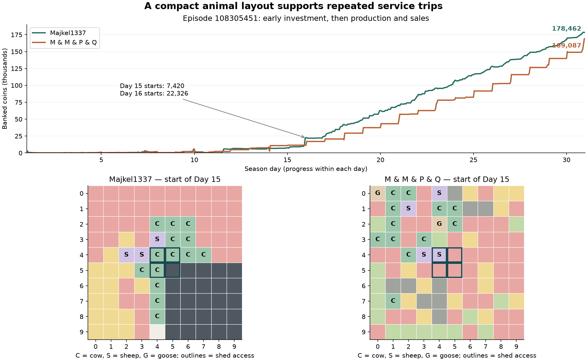

# Majkel1337 — capital deployment, compact service and selective sales

Reviewed September 12, 2026. Episode **108305451** ends **178,462–169,087**:
Majkel1337 (seat 0) beats M & M & P & Q by 9,375 banked coins. Both finish DONE.
The user's description supplies the player's leaderboard standing; this replay
does not independently establish a current rank or identify the bot's source.

This is a passive study of all 720 recorded states and 719 joint decisions.
It changes no agent code and runs no local game, training or counterfactual.
Dates and turns below use the UI's one-based numbering. Decision index 149 is
Day 7 Turn 6. Mechanics were checked by reading the pinned 1.32.7 engine source.

The outlined central squares permit shed access. C/S/G identify animals; pink
is strawberry, gold wheat, dark gray locked land and gray-green weeds.

## What actually explains the win

| Cash account | Majkel | Opponent |
|---|---:|---:|
| Starting cash | 3,000 | 3,000 |
| Net product receipts, after product purchases | 197,170 | 199,377 |
| Seeds | −6,590 | −10,380 |
| Animals | −7,100 | −9,400 |
| Land | −3,000 | −7,000 |
| Wages | −5,018 | −6,510 |
| Final banked coins | **178,462** | **169,087** |

Fixed purchases use observed seed/animal stock changes plus successful planting
and installation; wages use accepted hires. The product row is the reconciled
cash residual, **not independently reconstructed gross sales**. Each column
reconciles exactly. Majkel earns 2,207 fewer net product receipts but spends
11,582 less elsewhere: 11,582 − 2,207 = **9,375**, exactly its winning margin.

Majkel peaks at **74 productive tiles on three quadrants**, versus 100 on four.
More land or higher gross receipts alone does not establish a better strategy.
Conversely, our low wage bill against Anatoliy did not establish efficiency:
we left profitable work incomplete. Costs must be judged against delivered output.

## 1. Purchases finance a sequence of maturing cohorts

| Time | Confirmed behavior and purpose |
|---|---|
| Day 1, Turn 1 | Buys one cow and five wheat; cash 3,000 → 2,467. |
| Day 1, Turn 2 | Buys a second cow and three sheep; hires four hands. All five animals are installed by Turn 9. |
| Days 1–3 | Buys and plants twelve melons in total; buys ten initial wheat seeds on Day 1. |
| Day 3, Turn 13 | First strawberry seed purchase. Early cash is frequently below 100, but assets are being installed. |
| Day 7, Turn 6 | Buys northeast land for 1,000, shortly after the first sheep production. Six more cows are bought and installed that day. |
| Days 7–9 | Strawberry planting rises to 25 by the start of Day 9; a ninth cow is added on Day 9. |
| Day 10, Turn 12 | Buys southwest land for 2,000; ends the day with twelve installed cows. |
| Days 11–14 | Melon sales finance further purchases. Cow count reaches fourteen on Day 13. The final strawberry seed is bought Day 14 Turn 11 and planted Turn 21. |
| Days 15–30 | Repeated berries/milk/wool dominate income; retiring crop space increasingly returns to wheat. Wheat purchases continue through Day 28 Turn 18. |

Season totals are **14 cows, 3 sheep, 12 melon seeds, 41 strawberry seeds and
153 wheat seeds**. No geese, carrot/tomato seeds or fertilizer are purchased.
There are 50 requested strawberry seeds but only 41 acquisitions; failed requests
must not be counted as investments. All acquired seeds are eventually planted.

Purchases can use proceeds from earlier orders in the same action. At Day 10
Turn 12, Majkel begins with only 1,427 coins, sells four wool and one fertilizer,
then successfully buys the 2,000-coin quadrant and wheat. At Day 11 Turn 11 it
starts with 26 coins, sells six melons, buys a cow and requests 36 wheat; the
recorded wheat balance shows the full requested wheat amount does not fill.
This is working-capital sequencing, not borrowing or free purchases.

The opening also makes fertilizer an early source of liquidity before animal
products mature. Fertilizer sale orders begin on Day 2; wool begins on Day 7,
milk on Day 9 and melons on Day 11. This staggering connects long-payback assets
to nearer-term cash inflows.

The first five older Majkel replays have the same two-cow/three-sheep opening,
twelve-melon investment and first land purchase at decision 149. The repeated
opening is strong evidence of a structured policy family. Its later crop mix
varies across those games; the quantities here should not become unconditional
purchase rules for every town.

## 2. Planting speed captures the full horizon

All **41 strawberries reach all four production dates**: 164 plant-production
events. With fungible seeds matched FIFO, purchase-to-plant delay has a median
of **3 turns** and a maximum of **25 turns**, just over one game day. All are
planted by UI Day 14, allowing the fourth production sixteen days later to occur
by Day 30. This is a particularly important finite-horizon deadline.

In our reviewed Cycle 18 Anatoliy loss, three seeds remain from states 311–596,
almost twelve days, while cash rises from 12,525 to 44,418. Two are planted too
late to produce. Majkel converts committed capital into operating assets much
faster. Its occasional wheat seed backlog does not prevent cow or berry purchases.

Recorded harvest totals are 519 wheat, 369 milk, 306 strawberries, 101 wool and
72 melons. These are harvested units, not gross revenue or necessarily sold units.
The first large six-cow expansion is installed on Day 7 and begins producing on
Day 15. Cash rises from **7,420 at the start of Day 15 to 22,326 at the start of
Day 16**. Both this production cohort and delayed sales contribute to the jump.

## 3. Farm layout reduces repeated travel

At the start of Day 15, all seventeen animals are at most **three Manhattan
moves from a shed-access square**; mean distance is **1.41**, versus **3.89** for
the opponent's eighteen then-present animals. The opponent's farthest is eight
moves away. These distances describe layout, not exact realized tour lengths.

Majkel puts animals on and around the central access cells, then extends the
herd along neighboring rows/columns. Animals stay in their installed cells;
their layout is established through installation, not later herding. Units can
pick up feed or deposit output while standing on an animal's access tile.

On Day 15, the farmer deposits milk at (4,4), picks up three wheat, feeds/cares
for/collects fertilizer from a sheep at (4,3), repeats the service at a cow at
(4,2), then moves outward along the top crop rows, watering and fertilizing.
Worker 8 waters and harvests wheat at (2,3), replants and waters the new crop,
then continues through nearby rows. These are examples of finished sequences
of useful work, not proof of a particular hidden routing algorithm.

**Ordinary nights automatically transfer carried products to the shed and
reset workers.** Outward routes can therefore finish away from the shed, provided
storage capacity is available. Returning every worker solely for nightly delivery
would waste moves. The final recorded turn has no such overnight transfer, so
terminal delivery remains a separate requirement.

Movement is **47.4%** of Majkel's unit commands, versus our **65.3–65.5%** in
the two reviewed Cycle 18 losses. Adjacent inverse-move pairs number **31**,
versus our **357 and 507**. These pairs overlap in longer runs and are not a
count of disjoint lost round trips. The same-game opponent has only 40.7%
movement and zero reversals, yet loses: route statistics alone do not rank bots.

In CO terms this is a facility-location and routing problem: frequently serviced
assets justify valuable central space because travel savings recur every day.
Local worker/job continuity matters more than repeatedly choosing the best-looking
next destination and abandoning the previous route.

## 4. Water, feed, care and fertilizer are coordinated

WATER acts on one current tile, once per crop per day; there is no area watering.
Majkel issues 1,261 WATER commands. Of these, **83 are redundant same-cell
duplicates**, with no intervening harvest/replant in those groups. Thus even this
winner has coordination waste. More visible watered squares partly reflect a
larger productive farm, not a magical action or perfect water efficiency.

Every one of its **133 scheduled animal production events** has both feeding
and a positive banked care bonus. This is stronger evidence than merely counting
FEED/CARE commands. Care banks future output; feeding on the production boundary
allows that bonus to be collected. The opponent has eight unfed production
events and nine without a usable care bonus.

Majkel's 172 fertilizer commands target **110 strawberries and 62 wheat**;
three are same-cell duplicates. It collects animal fertilizer rather than buying
it, combines nearby collection/application work, and sells some surplus. There
are 146 fertilized strawberry production events out of 164 (**89.0%**). Our two
Cycle 18 games have 45/47 and 51/52 bonuses, so our existing strawberry timing
should be retained. Our more serious deficit is the number and maturity of plants.

Wheat harvest timing is variable. Verified daytime examples include 46 five-unit
harvests at age three, 42 two-unit harvests at age two and five six-unit harvests
at age four. Waiting for maximum yield is not a universal rule. Earlier harvest
can release cash, feed, space and worker availability; the comparison must charge
the additional watering, fertilizer and delayed next planting.

Sheep produce their last available batch on Day 28. Feeding then stops; all
three escape at the start of Day 30 after their output is harvested. A further
batch would fall on Day 31, beyond the game. This is consistent with deliberate
retirement and illustrates why maximizing survival until the final screen is
not the actual objective. The hidden intent is not observable.

## 5. Sales balance liquidity, price recovery and storage

Majkel requests sales in **249 different decisions**, versus 74 for its opponent.
It submits 93 milk sale orders, most for two to six units, and 80 berry sale
orders. Those are order counts/quantities, not reconstructed transaction fills.
It does **not** follow a strict once-every-four-turn sale schedule: sale decisions
occur in every residue class modulo four. Town shops consume stock every four
turns, so that cadence matters to prices without completely specifying its policy.

Examples establish selective holding:

- Wool sells on Days 7 and 10, then no wool sale is requested until Day 19 Turn
  10. The observed quote falls to 93 at the start of Day 14, then rises to 209
  before that Day 19 sale. The yarn store opens on Day 16. Later sales are small
  batches. Quoted pre-action prices are not average execution prices.
- Forty melons sit in the shed from the start of Day 14 and are sold together
  on **Day 15 Turn 23**, when the pre-action quote is 247. That is also a storage
  constraint episode: the shed reaches its 100-unit capacity during Day 15.
- First berries are harvested before their first sale on Day 15 Turn 22; sales
  grow more frequent around Days 17–18 as stock and production rise.
- Product-specific PLACE is used 109 times, principally fertilizer and milk.
  It can deposit saleable goods while retaining feed. For example, Day 8 Turn 11
  deposits one fertilizer but keeps one carried wheat. This is an operational
  inventory choice, not by itself proof of a price-timing algorithm.

Holding can improve price, but neither the replay nor an observed price rise
proves it beat earlier sales after accounting for reinvestment opportunities and
the opponent's response. Both players' trades influence the shared price. A
future policy should compare expected later proceeds with today's proceeds,
foregone investment, warehouse space and remaining liquidation time.

## 6. Demand makes this portfolio unusually favorable

The first three shops, on Days 4, 7 and 10, are all ice-cream shops. Day 13 adds
a smoothie shop. These create substantial recurring demand for milk and berries;
ice-cream shops also consume wheat. Day 16 adds yarn, Days 19/22 pizza, and Day
25 a bakery. The two players share this unusually supportive milk/berry economy.

Majkel buys additional cows after milk demand is already visible and installs
large berry cohorts in time to exploit later demand. This is consistent with
adaptive production, but the replay cannot reveal its exact forecast or show
whether it anticipated unrevealed shops. Our agent must use visible information,
not this replay's future unlocks. The older five Majkel games end at approximately
89K–148K, reinforcing that **178K is not a guaranteed output target in every town**.

## 7. What we should retain, change and measure

The current next priority remains an execution repair, informed by this layout:

1. **Keep stable, compact daily assignments.** Reserve worker/job ownership;
   finish animal service and continue into neighboring crop work. Avoid spending
   the action budget oscillating between freshly recalculated routes.
2. **Make purchased assets reach production on time.** Give each planting and
   installation a feasible deadline. Separate seed backlog limits from evaluation
   of unrelated profitable investments; reject stale seeds that cannot mature.
3. **Match growth to delivered service.** Use realized care, harvest and route
   completion to constrain forecasts. Majkel uses four hands on Days 1–2, six on
   Days 3–6, eight on Day 7, nine on Days 8–9, eleven on Days 10–28, and ten on
   Days 29–30. Eleven daily hires cost 232; the twelfth alone costs 144. This
   discrete marginal cost supports efficient crews, not a universal eleven-hand cap.
4. **Preserve our strong fertilizer and final-delivery behavior.** After physical
   throughput is repaired, add a bounded sale/holding rule that reserves overnight
   shed capacity and compares price recovery with earlier reinvestment.

CO250 interpretation: maximize final cash under cash-flow, land, labor, input,
storage and maturity constraints. A turn of labor, a seed waiting to be planted,
and a warehouse slot each have an opportunity cost. Adding a hired worker or
quadrant is an integer decision with a discontinuous cost. The best bundle is
the one whose achievable marginal receipts exceed those costs before termination.

Do not copy the winner's errors: passive inventory conservation proves **two
strawberries lost on Day 14 Turn 24 and six milk lost on Day 15 Turns 11/13**,
with full storage and no matching sales/harvests. It also ends with twelve wheat
and four fertilizer in the shed, one carried fertilizer and one wheat held on a
plant. Some premature wheat deaths and two berries decaying with remaining yield
occur. Neither its near-zero opening reserve nor its market holding is flawless.

Its opponent generates slightly greater net product receipts and sharply narrows
the gap on the final day (+29,233 cash versus Majkel's +10,866). Majkel wins because
its earlier productive investment and cost discipline are sufficient, not because
every phase or mechanic is superior.

## Evidence and limits

[Machine-readable evidence](benchmarks/majkel-108305451-study.json) contains the
replay hash, daily snapshots, confirmed fixed purchases, costs, hiring, plantings,
maintenance/production counts, selected sale traces and order-count qualifications.
The existing [passive analyzer](../scripts/study_recorded_games.py) supplies the
base replay aggregation; this review adds direct state-difference and cash-ledger
analysis. Harvest counts include identifiable night-boundary additions; the audit
found no unresolved boundary harvest cases for either player in this episode.

There is no source access to Majkel's bot. These observations cannot establish
whether its author used an LLM, trained model, solver or manually tuned rules.
No training or paid compute is required to implement the demonstrated layout,
execution and accounting improvements. No new submission is produced by this study.
