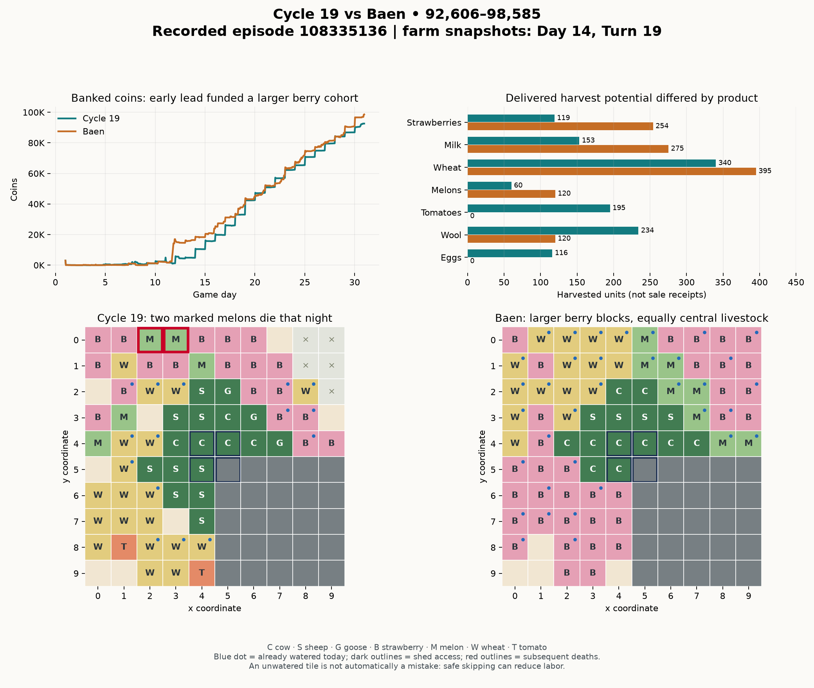

# Cycle 19 versus Baen — deadline coverage, opening liquidity and crop timing

Episode **108335136** ends **92,606–98,585**, a **5,979-coin loss** for Unicorns
(seat 0). Baen is seat 1. Both finish DONE. All **719 own decisions match the
preserved Cycle 19 artifact**, SHA-256 `eb151fe1e088e598edfdcd6b10c5c108bdb91783bfbbac9758211b5df29bd17d`.
All 719 supplied log entries have empty stdout/stderr. Median server decision
duration is 0.00405 seconds; maximum is 0.122665 seconds, below the configured
one-second action limit. This was a strategy/execution loss, not a timeout or
wrong-artifact problem.

This review reads 720 existing states and compares policy outputs against their
recorded observations, preserving policy memory for source identification. It
does not apply returned actions, import the game engine, run a local match or
evaluate a counterfactual season. UI days/turns are one-based; grid coordinates
are zero-based. [Structured evidence](benchmarks/cycle-19-baen-108335136.json).

## What worked in Cycle 19

Our routing repair has direct evidence behind it: **three adjacent movement
reversals**, versus 357–507 in the previously reviewed Cycle 18 losses. There
are no duplicate productive commands, no same-crop seed oversubscription, and
no seeds left unplanted at termination. Movement is 40.9% of recorded unit
commands, versus Baen's 50.4%. These figures do not prove optimal routing, but
the old oscillation problem is largely absent from this game.

Animal service is particularly strong: **all 155 production events occur fed
and with a care bonus**. The ten unfed animal-night records occur after those
animals' last useful production dates. They are consistent with the implemented
retirement rule, not lost production from starvation. Baen has 111 animal
production events, including two unfed/zero-bonus events.

Our endgame inventory handling is clean: the final shed, carries, seeds and
held field output are all empty. Baen has an empty shed/carries but retains
eight wheat seeds, seven carrot seeds and two field-held wheat. Unused seeds
are sunk spending, not banked points. No missing terminal liquidation explains
our loss.

Both players expand to **three quadrants**, peaking at 72 productive tiles for
us and 74 for Baen. We buy land on Day 7 Turn 17 and Day 11 Turn 2; Baen buys
on Day 7 Turn 5 and Day 12 Turn 1. We actually buy the third quadrant earlier.
This is not another failure to expand or a reason to force a fourth quadrant.

## The cash account reconciles exactly

| Account | Cycle 19 | Baen |
|---|---:|---:|
| Initial cash | 3,000 | 3,000 |
| Net product receipts after product purchases | 110,024 | 117,172 |
| Seeds | −5,000 | −6,610 |
| Animals | −7,400 | −6,000 |
| Land | −3,000 | −3,000 |
| Wages | −5,018 | −5,977 |
| Final banked coins | **92,606** | **98,585** |

Fixed purchases use observed stock changes plus successful installations and
plantings; wages use accepted hires. The product row is the reconciled cash
residual, **not independently reconstructed gross sales by product**. Baen spends
1,169 more in these fixed costs and wages, but generates 7,148 more net product
receipts: 7,148 − 1,169 = **5,979**, exactly its advantage.

Requested orders must not be treated as fills. For example, Baen requests 1,138
wheat sales and 1,906 fertilizer sales across the replay, far more than the
corresponding available output. Some requests cannot fill as written. There is
no evidence here of a profitable buy/sell exploit or free resources.

## 1. Opening timing gave Baen a financing advantage

Our opening purchases two cows, three sheep, ten wheat seeds and a staggered
melon cohort. Baen starts with two cows, two sheep, seven wheat seeds and all
twelve initial melon seeds. It installs all twelve melons on **Day 1**; we plant
three on Day 1, four on Day 3 and five on Day 4. Our seed-to-plant delays are
short once seeds are purchased; the first bottleneck is the purchase schedule
and allocation of opening cash, not the old multi-day abandoned seed queue.

Baen also installs additional cows on Days 4 and 6, and later buys eight more
melon seeds, reaching twenty melon plantings in total. Its opening is not
perfect: cash falls to 16 at the start of Day 2 and it hires no hands that day.
That is not a staffing pattern to copy indiscriminately.

On **Day 11**, Baen sells its first 60 melons through several intraday deposits
and market orders; the opening quote is 272. Our first 18-melon sale happens
on **Day 12 Turn 1**, when the quote is 226. At the start of Day 12, Baen has
**16,992 coins versus our 1,223**, although our third land purchase has already
occurred. Cash and fixed capital both matter when comparing those balances.

Baen uses that liquidity on Day 12 Turn 1 to buy two cows, its third quadrant
and **23 strawberry seeds**. Sixteen of those berries are planted that day and
seven the next day, with time for four production events before termination.
Its total berry count reaches 34; ours stays at 19. The early melon sale becomes
capital for later recurring output, not merely a temporarily high cash balance.

The later melon expansion is much less attractive: its final four melon units
sell at quotes of 4, 1 and 1 on Day 19. The market saturates. The lesson is
earlier execution and financing, not an unconditional twenty-melon target.

**Economics:** working capital and time to first cash flow can be more valuable
than a slightly larger opening herd. A profitable crop that matures after a rival
has sold into the market can have a very different return on the same seed cost.

## 2. Central livestock placement is already good on both farms

At the start of Day 14, all our seventeen animals are within **two Manhattan
moves** of a shed-access square; mean distance is **1.29**. Baen's fourteen
animals are also within two moves; mean distance is **1.21**. These are geometric
distances, not full realized tour costs. Both have compact central livestock.

The meaningful difference is the crop area and how workers service it. Baen's
southwest quadrant becomes a large strawberry cohort. Our southwest initially
mixes wheat and additional sheep, then receives tomatoes. Our extreme northern
crop rows are repeatedly reached late or left unserved. The figure marks two
mature melons on that edge which die after the shown observation.

Grouping crops with similar production dates can simplify scheduled service;
it can also create a synchronized workload peak. Layout should be evaluated
against the actual route and daily deadline, not only distance from the shed.
The fixed angular sectors in Cycle 19 prevent churn, but their static tile
weights do not guarantee balanced daily work across sectors.

## 3. Baen spends watering actions on the right dates

| Measure | Cycle 19 | Baen |
|---|---:|---:|
| Strawberry plants established | 19 | 34 |
| Strawberry production events | 70 | 132 |
| Events with fertilizer bonus | 55 / 70 = **78.6%** | 122 / 132 = **92.4%** |
| Production events without watering | 7 | 1 |
| Strawberry harvest | 119 | 254 |
| All crop WATER commands | 1,015 | 947 |
| All FERTILIZE commands | 133 | 64 |
| PICKUP commands | 298 | 129 |

Baen waters more economically, not simply more often. Among its surviving berry
plants it waters **all 33 at age 9, all 33 at age 11, 32/33 at age 13, and all
33 at age 15**. Those nights precede production at ages 10, 12, 14 and 16. At
ages 10, 12 and 14 it leaves 28, 25 and 25 berry plots unwatered respectively,
usually after a watered day. Skipping one safe night preserves the plant while
saving work; two consecutive unwatered nights kill it.

Cycle 19 normally requests daily watering for living repeaters. It spends work
on safe nonproduction days, yet misses seven important production waterings.
An every-other-day rule alone is not sufficient either: the correct schedule
must respect current drought state, production dates and fertilizer coverage.

Baen applies all 64 fertilizer commands to strawberries. We apply 30 to berries,
58 to wheat and 45 to tomatoes. Our wheat productivity is stronger—340 harvest
from 84 plants, versus 395 from 127 for Baen—but that does not establish that
every fertilizer trip was worth its travel and competing deadline. Fertilizer
placement and pickup costs need to be valued with the route, not only the crop's
extra sale value.

**CO connection:** watering is a scheduling problem with hard survival deadlines
and additional rewards on specific production dates. The objective is marginal
banked output per scarce worker action, not the number of blue watered squares.
Fertilizer has a sale value and an input-delivery cost; both are opportunity costs.

## 4. A concrete failure: routine wheat work outranks ripe melons

On **Day 14**, melons at **(2,0)** and **(3,0)** each hold five units and have
already missed the previous day's watering. They need service before night.
Their source-generated jobs correctly carry urgency 5 and WATER/HARVEST ops.
The dispatcher nevertheless follows current commitments and geographic order.

Worker 2 is at (3,1) on Turns 21–22 and fertilizes/waters wheat. It then moves
to (2,1) and waters another wheat plot on Turn 24. Worker 3 waters/harvests wheat
at (4,1), then moves to (4,0) and waters there. Both melon tiles remain unwatered
and die after Turn 24. Watering itself requires no shed space; the recorded
choice to service nearby wheat exposes the dispatch-priority problem.

We subsequently sell only 60 melon units from twelve plants. Baen harvests all
120 units from twenty plants. The twelve-unit difference between our potential
full melon yield and actual harvest includes the two lost plants; their observed
five units each were already present before death. Additional hypothetical sale
proceeds would depend on route costs, timing and shared-price effects.

Three own strawberries at (0,0), (1,0) and (2,1) also die on Day 17, after two
production dates each. That removes six later production events from the maximum
76 possible for our nineteen early berry plantings. Seven wheat plants are lost
to drought or overdue yield decay. One additional expired berry leaves a unit
uncollected. Empty exhausted tomato retirement is not classified as a loss.

The root issue is deadline coverage, not excessive movement reversals. We issue
1,001 PASS commands versus Baen's 667, but late idle workers may already be too
far from unfinished work. Reducing PASS indiscriminately or hiring more hands
does not solve that spatial mismatch. New planting in a busy sector can also
take time away from its established high-value assets.

## 5. Output mix and the changing market

| Harvested units, not receipts | Cycle 19 | Baen |
|---|---:|---:|
| Milk | 153 | 275 |
| Strawberries | 119 | 254 |
| Melons | 60 | 120 |
| Wheat | 340 | 395 |
| Wool | 234 | 120 |
| Eggs | 116 | 0 |
| Tomatoes | 195 | 0 |
| Carrots | 0 | 15 |

Our herd ends up at five cows, nine sheep and three geese; Baen buys ten cows
and four sheep. We spend more on livestock despite owning fewer cows. Our
additional wool, eggs and tomatoes generate substantial income and keep the
match close; replacing them wholesale with cows is not established as optimal.

The revealed town is pizza, brunch, yarn, bakery, farmers market, then three
ice-cream shops. Strawberries obtain shop support on Day 7 and further support
on Days 16, 19, 22 and 25. Milk has pizza demand from Day 4 but still falls
from a quote of 208 at the start of Day 13 to 34 on Day 22 as supply arrives.
It later partially recovers. Wool falls from 221 on Day 16 to 77 on Day 30;
one of our final wool sales is requested at a one-coin quote.

This creates both substitution opportunities and risk. Our seventeen-animal
ceiling is filled by Day 12, leaving no ordinary expansion capacity for a later
change in visible demand. That is an investment-timing/option-value issue, not
proof that the cap should simply be raised. Extra animals require continuing
feed and service; abandoning productive sheep also has a cost.

We earn back much of the early deficit, reaching within 854 at the start of
Day 22. Baen's larger later berry cohort then helps it retain the lead. On the
last day we add 5,751 coins and Baen adds 7,526. Both finish with clean saleable
inventory, so the final difference reflects output and prices rather than a
large pile of unsold goods.

## Priorities for the next revision

1. **Make crop service depend on the production calendar and time remaining.**
   Preserve urgent survival watering; skip demonstrably safe, unproductive
   watering; reserve fertilizer and visits before bonus-producing nights. Use
   real travel/input costs to start rescue early enough for distant plots.
2. **Balance daily sector workloads without restoring route churn.** Keep stable
   commitments, but let workers finish endangered or expiring output before
   routine planting. Admit new crops only when their service can fit. Review
   pickup batching and distant input trips before increasing headcount.
3. **Review opening cash allocation and first-cohort sales.** Compare the benefit
   of earlier melon establishment/deposit with extra sheep, feed reserves and
   staffing. Do not copy Baen's later saturated melon purchases or cash-starved
   no-hand day automatically.
4. **Keep portfolio flexibility as demand is revealed.** Evaluate sheep/cow/goose
   allocation using shared supply, feed and remaining output, while retaining
   room or capital for later observed opportunities. Preserve profitable tomato
   and egg diversification rather than assuming the opponent's mix always wins.

Cycle 20 already changes supply forecasts and adds late-day survival rescue.
It still uses Cycle 19's daily watering rule, opening, static sector weights,
staffing targets and herd cap. It therefore addresses part of this evidence,
not the complete scheduling issue. No Cycle 20 server outcome is inferred from
this Cycle 19 replay.

**This turn is a review only.** Cycle 19 and Cycle 20 source/artifact hashes are
unchanged; no new submission is prepared or uploaded. Keep collecting both
wins and losses so the next change is not fitted only to this opponent or town.
