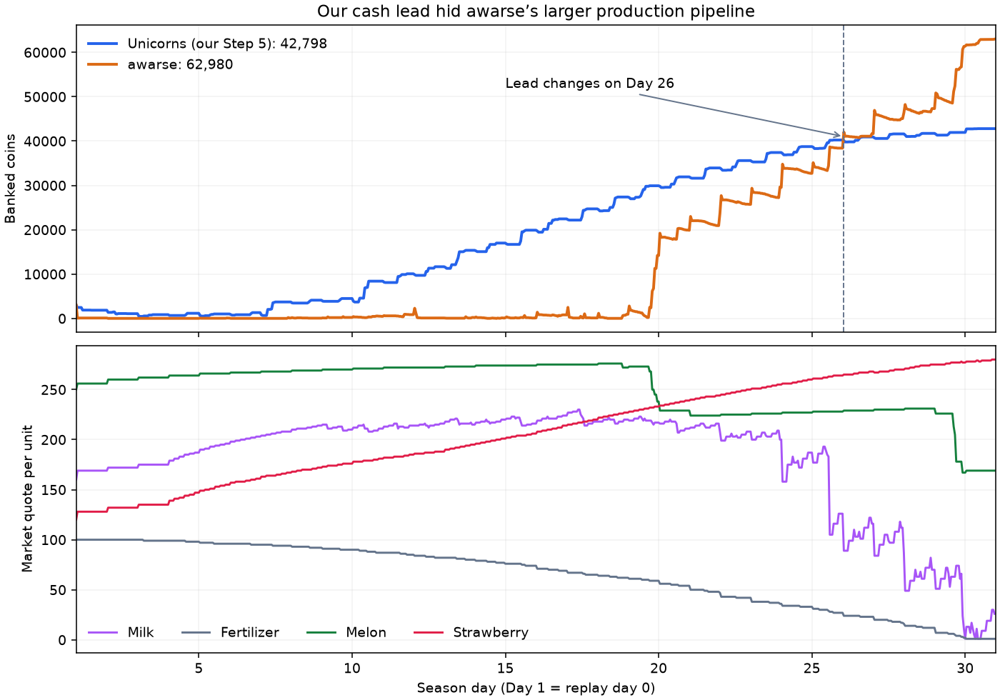

# Step 5 server validation and the awarse loss

Audited September 10, 2026. Both supplied episodes resimulate exactly in `kaggle-environments==1.32.7`: no discrepancies in farm state, private inventory, market, town, day, or hour. Instrumented **executed transactions** reconcile each terminal bank balance. Our actions also match the frozen Step 5 source when evaluated on reconstructed runtime observations. [Accounting and source evidence](benchmarks/step-5-server.json).

The user's reported rating was 504.2. A subsequent CLI snapshot listed submission `56148466` as `COMPLETE`, at 573.3. These are different snapshots of a changing skill rating, not coin totals or proof of medal strength.

## Validation episode 107533896

Both Unicorns agents finish with **69,761 coins**, `DONE`, and no stderr in the supplied logs. Each farm sells 83,799 and spends 17,038, so `3,000 + 83,799 − 17,038 = 69,761`. Its herd peaks at six cows and four sheep. There are no missed feedings, escapes, ineffective non-pass operations, inventory overflows, or unsold final stock. Recorded maximum decision times are 0.046466 seconds and 0.101818 seconds for the two seats.

This establishes server validity for the uploaded Step 5 file, SHA-256 `70fa2f8a16316bb51fc2ce9eb01b08259fdb83c256359ffc29e847dd459d5816`. Self-play does not establish competitive strength.

## Competitive episode 107536016

| Executed result | Unicorns, our Step 5 | awarse |
| --- | ---: | ---: |
| Final bank | 42,798 | 62,980 |
| Gross sales | 53,084 | 135,528 |
| Total spending | 13,286 | 75,548 |
| Labor spending | 303 | 12,994 |
| Animal acquisition | 3,400 | 11,300 |
| Wheat purchases | 9,583 | 43,104 |
| Wheat sales | 798 | 28,516 |
| Land spending | 0 | 3,000 |
| Peak simultaneously productive tiles | 8 | 58 |
| Largest owned area | 25 | 75 |

awarse generates **82,444 more sales**, pays **62,262 more costs**, and therefore wins by **20,182**. Large expenditure alone did not make their strategy worse; the additional production more than paid for it in this game. Their peak species counts include 22 cows, four sheep, 12 melons, 11 wheat, nine strawberries, and two carrots; these individual peaks need not occur simultaneously.



Our maximum cash lead is **29,584 at state 447**, during Day 19. The first transition to a negative lead occurs at state 601, after the opening action of **Day 26**. We are already 5,590 behind at the start of Day 29. The late burst widens an existing deficit; it is not a last-action liquidation mistake by our bot.

On Day 29, awarse sells **34,742** and spends **20,685**, gaining **14,057 net cash**. Melons contribute **9,782 of the sales**. Wheat buying and selling that day net to **zero cash**. Calling the full sales burst crop profit, or treating gross wheat resale as a farming return, would be wrong. Our bank grows only 217 that day.

## What worked

- Our livestock execution is reliable: no missed feedings, escaped animals, ineffective non-pass commands, or final unsold inventory. The supplied Unicorns log has no stderr and a 0.046049-second maximum decision time.
- Shared routes control labor costs. Our 303-coin bill is far below awarse's 12,994. We record 49 worker-days in which a worker services multiple animals.
- Early delivery captures better animal prices: our average milk sale earns 176.19 per unit versus awarse's 138.07; wool averages 104.54 versus 76.51. These are executed averages, not evidence of a universally superior timing algorithm.

## What failed economically

**We stopped expanding useful production too soon.** Eight animals occupied only eight of 25 owned tiles. Cash accumulated while awarse financed a much larger pipeline. Our capital rule could decline another cow or sheep, but had no crop alternative to choose. A large bank lead is not a reliable estimate of terminal advantage when the rival has visible maturing assets.

**Our revenue remained concentrated in a shared livestock market.** Milk falls from a quote of 219 near our largest lead to one coin at the opening of Day 30. Fertilizer falls from 60 to two coins over the same interval. Wool reaches the floor repeatedly. We sell 21 wool units, three milk units, and eight fertilizer units at one coin. Product diversification can use capacity when another animal would worsen oversupply.

**We left valuable crops and internal inputs unused.** awarse sells 120 melons for 27,675 and 27 strawberries for 7,345. Our bot produces neither. We buy all feed and sell all fertilizer. The next policy should compare wheat's feed-replacement value with selling it, and fertilizer's extra crop output with its forgone sale proceeds.

**awarse also has weaknesses.** They lose one sheep, record 35 unfed animal-days, have three ineffective pickups, and lose 11 wheat units and three carrot units to decay. Some reduced animal care may be intentional; a replay cannot establish the author's intent. We should preserve our operational reliability while testing productive scale, rather than copying those failures or their exact commands.

## Optimization interpretation and next step

The objective is terminal bank, so an intermediate cash lead is only one component of the state. Our missing decision is an integer allocation among livestock, crops, retained cash, and labor. Its constraints include dated working capital, survival watering, harvest deadlines, worker travel, seed/feed/fertilizer balances, and storage. The market is shared: a rival's visible production changes marginal revenue, so additional volume cannot be valued at a fixed current price.

Step 6 introduces a bounded crop menu and area, preserves livestock duties, reserves planting-day watering, sizes supporting labor from committed workload, and values fertilizer against selling it. This is an incremental implementation of those constraints. Expanded land, a richer rival-supply forecast, and explicit terminal win-probability planning remain future work.

## Reproduce the transaction audit

```bash
uv run python scripts/audit_replay.py \
  /Users/ryokitano/Downloads/107533896.json \
  /Users/ryokitano/Downloads/107536016.json \
  --output artifacts/step-6-server-audit
```

Use a new output directory if it already exists. The script instruments the local engine's successful market commits, hire/land payments, unit effects, overflow, decay, and feeding transitions; it restores the instrumented functions on exit. Replays and logs are treated as data. The raw files stay outside Git; the committed audit contains their hashes and derived evidence.

JSON serialization can reorder inventory keys and therefore the order of otherwise separate product sales. For exact source attribution, our additional check reconstructs the engine's runtime observations rather than comparing against reordered JSON dictionaries. All 719 actions per supplied Unicorns seat match under that check.
