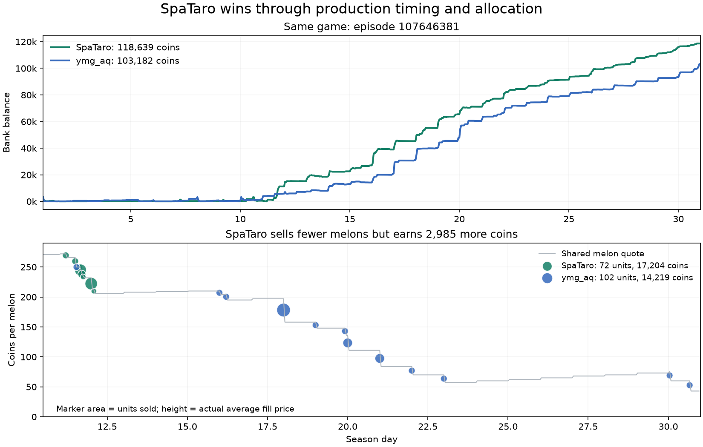

# Step 6 validation and the latest SpaTaro game

Audited September 10, 2026, Toronto time. [Accounting, timing, input hashes, and live snapshots](benchmarks/step-6-server-and-leader.json) · [Revised implementation plan](STEP_7_PLAN.md).

**Step 6 is server valid, but our production policy remains structurally conservative.** The leading-player replay reinforces the value of early crop output, integrated crop/animal scheduling, and profitable scale. It also exposes why valuing a seed separately from its future fertilizer and labor can exclude a useful crop.

Both supplied replays reproduce exactly in the pinned official engine, version 1.32.7. Farm state, private inventory, market, town, day, and hour match throughout. Executed transactions reconcile all terminal bank balances. The new validation's 1,438 actions match our current source on reconstructed runtime observations.

## What the supplied files establish

| Episode | Players | Final bank | Interpretation |
| --- | --- | --- | --- |
| 107547593 | Unicorns vs Unicorns | 63,524 each | Step 6 server validation self-play |
| 107646381 | SpaTaro vs ymg_aq | 118,639 vs 103,182 | Competitive match between two leading teams |

The read-only Kaggle snapshot at approximately 2026-09-11 01:01 UTC shows Step 6 submission **56149269** complete at **590.8**, and Step 5 at **506.5**. SpaTaro is first at 3130.4; ymg_aq is third at 3030.2. These are dated skill ratings, not coin totals. The current latest-two submissions are Steps 6 and 5.

Our supplied episode is not a ladder match against another team. It validates execution and reveals behavior; it cannot establish how Step 6 handles a strong rival. Likewise, 63,524 in self-play and 118,639 in another market are not comparable measures of strength.

## Our Step 6: what worked and what remains missing

Each farm reconciles as `3,000 + 78,683 sales − 18,159 spending = 63,524`. It operates seven sheep and three cows, at most eight crop plots, and a maximum of 18 productive tiles inside its initial 25 tiles.

| Observed result, per farm | Quantity / coins |
| --- | ---: |
| Wool sales | 194 units / 41,521 |
| Milk sales | 102 units / 6,540 |
| Melon sales | 72 units / 15,352 |
| Fertilizer sales | 243 units / 12,539 |
| Wheat sales | 57 units / 2,731 |
| Wheat purchases | 254 units / 11,140 |
| Labor spending | 1,249 |
| Actual plantings | 11 wheat, 12 melon, zero strawberry |
| Fertilizer applications | Two, both on wheat |

The wheat balance is `48 harvested + 254 bought = 57 sold + 245 fed`. Wheat sales include purchased inventory; they are not all crop revenue. The fertilizer balance is `245 collected = 243 sold + 2 applied`.

Operationally, the result is clean: zero ineffective non-pass unit commands, animal escapes, unfed animal-days, decay losses, overflow, final stock, or unused seeds. Both logs contain no stdout/stderr; maximum recorded decisions are 0.111937 and 0.121125 seconds. All 12 melons are harvested at age ten for six units each. The scheduler mixes crop and animal service on 51 worker-days and serves multiple animals on 55 worker-days.

The economic constraints are more revealing:

- No crop is planted on Day 1 or 2. The first melon is planted on Day 4; most initial melon planting occurs on Days 7–10.
- All 72 melons sell over Days 14–29. A later sale faces a different price and finances fewer remaining investments.
- Seven owned tiles remain outside the maximum productive footprint. The eight-crop cap, crop-count limit tied to herd size, reserved livestock locations, and livestock-first cash allocation are policy restrictions, not game rules.
- The crop model predicts four base strawberry units and does not include future fertilizer when admitting a new crop. Fertilizer is considered later, for existing plants. Consequently, it cannot compare the full seed/fertilizer/labor package against a melon package at admission time.
- Our town already has strawberry demand from Day 4, rising later, but the policy never plants strawberries. This identifies a candidate opportunity, not proof that a specific strawberry purchase would beat its alternatives.

The recorded PASS share is 41.3%. Some idle actions are harmless because wages already paid are sunk; reducing PASS alone is not an objective. The useful question is whether those workers could finish additional profitable activities or whether fewer hires would preserve output.

## How SpaTaro wins this game

| Same-game result | SpaTaro | ymg_aq |
| --- | ---: | ---: |
| Final bank | 118,639 | 103,182 |
| Gross sales | 149,716 | 135,332 |
| Spending | 34,077 | 35,150 |
| Labor spending | 4,079 | 7,777 |
| Land spending | 3,000 | 3,000 |
| Maximum productive tiles | 75 | 75 |
| Peak hired hands | 12 | 12 |
| Successful crop plantings | 208 | 240 |
| Wool sales | 397 units / 69,294 | 334 units / 46,409 |
| Melon sales | 72 units / 17,204 | 102 units / 14,219 |
| Strawberry sales | 127 units / 23,327 | 125 units / 22,398 |

SpaTaro earns **14,384 more sales** and spends **1,073 less**, giving the exact **15,457 winning margin**. The largest positive product difference is **22,885 additional wool receipts**, partly offset by ymg_aq's greater milk, egg, carrot, and tomato receipts. SpaTaro also saves 3,698 in wages. Those are accounting contributions; isolating each policy choice's causal effect would require controlled experiments.



### 1. Early melons monetize scarce price headroom

SpaTaro plants **all 12 melons on Day 1**, harvests at age ten, sells 48 units during Day 11 and the remaining 24 early on Day 12. Its average realized price is **238.94**. ymg_aq sells six units on Day 11, with most of its output much later, averaging **139.40**. SpaTaro sells 30 fewer units yet earns 2,985 more coins.

This repeats the earlier SpaTaro–Otter Vibe replay: 78 versus 102 melons, but 17,511 versus 13,336 in receipts. The repeated observation supports testing early production and delivery. It does not imply that twelve opening melons is always optimal: another early producer can depress the same market.

**Economics/game theory:** each farm sells into a shared price curve. Early sales capture available high prices and change later sellers' returns. Market impact on our remaining output must also be counted. Shop rules give melons only the town center's one unit/day of demand; no shop unlock adds melon demand. A second melon cycle therefore deserves a different valuation from the opening cycle.

### 2. Expansion supports a changing portfolio

SpaTaro buys land on **Day 7, hour 6**, and **Day 10, hour 15**; hours here are zero-based. The cost is 1,000 plus 2,000. It reaches 20 sheep and two cows, with 40 wheat and 18 strawberries at their individual peaks. Later short crops fill remaining useful time. Individual peaks need not occur simultaneously.

It uses 213 worker-days that combine crop and animal tasks. This is materially different from letting crops use only the residual time after all livestock service. ymg_aq expands sooner but still loses, so buying land earlier by itself is not the explanation. Land must be supported by executable productive schedules.

### 3. Strawberry production includes complementary inputs

SpaTaro plants 18 strawberry lots, applies fertilizer 44 times, and harvests 127 units. Of its 66 strawberry harvest actions, 61 yield two units and five yield one. ymg_aq uses a particularly regular fertilizer schedule: 16 applications at age nine and 16 at age thirteen. Both obtain much more than the four-unit base lifetime crop when harvesting and fertilizer timing permit it.

In the pinned engine, fertilizer lasts the application day and the next two days. Watering with active fertilizer before the production transitions at ages 10/12/14/16 can yield two units per event. Applications at ages nine and thirteen can cover the required transitions at ages 9/11 and 13/15. Storage, worker actions, and actual fertilizer availability still constrain execution.

**CO250 connection:** seed plus dated fertilizer plus watering/harvest work is a complementary integer activity. Rejecting the seed using only unfertilized output can prevent selection of a profitable complete package. An integrated model must reserve those inputs and charge their alternative uses, rather than assume future fertilizer is free or certain.

### 4. More work is not automatically more value

Both bots reach twelve hired hands, but ymg_aq hires twelve every day from Day 13 through Day 30. SpaTaro usually operates with fewer and reduces hires late. Twelve hired hands cost 376/day; eleven cost 232/day. One extra hand costs 144, so its route needs to enable more than 144 additional expected coins.

SpaTaro has a 14.25% PASS share versus ymg_aq's 3.63%, yet wins. Busy workers can perform lower-value work. A worker's marginal contribution must include output saved, delivery timing, displaced tasks, and its actual remaining actions.

### 5. Maintenance and retirement are economic choices

As wool and fertilizer prices weaken, SpaTaro reduces sheep feeding and care; 13 sheep eventually escape, and the audit records 65 unfed animal-days among animals that survive that refresh. ymg_aq records 90 such days and seven sheep escapes. The engine permits a skipped feeding refresh before escape and continues base production on surviving animals; care-enhanced production has additional conditions.

This is consistent with selective maintenance or retirement, but the replay cannot establish intent or optimality. Some incidents may be scheduling failures. Our future model should distinguish full service, minimum survival, and retirement by their remaining recoverable value. It should not classify every planned missed feeding as an execution error, nor excuse an unplanned escape by labeling it strategic after the fact.

### Behaviors we should not imitate blindly

SpaTaro reaches zero cash and hires nobody on Day 2. That exposes a liquidity failure case for any copied opening. It issues 183 unsupported product-buy orders, all ignored; these are not successful trades. It also has 15 ineffective non-pass operations, loses two carrot units to decay and one wheat plus one fertilizer to overnight overflow, and finishes with 12 fertilizer and two wool across shed and carried stock. Its winning result does not make those actions desirable.

The exact wheat balance is `564 harvested + 370 bought = 557 sold + 376 fed + 1 overflow`. Fertilizer is `410 collected + 15 bought = 291 sold + 121 applied + 12 left + 1 overflow`. Gross resale receipts must not be mistaken for production profit or arbitrage.

## An evaluation detail: equal seeds do not fix the town

The Step 5 and Step 6 validation episodes both use seed zero, but their first shop is respectively a pizza shop and a farmers market. `_end_of_day` uses one daily RNG for weed spawning and the later shop choice; weed draws depend on the number of empty tiles. Different actions can therefore change future shop draws even with the same seed.

Matched seeds remain useful for reproducibility and paired evaluation of whole policies. They do not hold the town schedule fixed while changing the policy. For a causal test of scheduling or crop yield, use controlled states or a clearly labeled fixed-demand diagnostic, then return to the unmodified official environment for promotion. Never give the acting agent the evaluation seed or future replay shops.

## Next checkpoint

Preserve the valid Step 6 artifact. Implement a **joint opening and dated production-bundle planner** next: compare early crops with livestock investment, include fertilizer-backed crop alternatives, reserve realistic operating cash, and schedule delivery before modeled price deterioration. Build stronger reactive controls alongside it. Conditional land expansion and flexible routes follow, then selective maintenance. [The staged plan](STEP_7_PLAN.md) defines the CO model and release gates.

This analysis changes the development priorities; it does not change `main.py` or claim a new competitive improvement.

## Reproduce

```bash
uv run python scripts/audit_replay.py \
  /Users/ryokitano/Downloads/107547593.json \
  /Users/ryokitano/Downloads/107646381.json \
  --output artifacts/step-6-server-and-leader
uv run python scripts/replay_timing.py \
  /Users/ryokitano/Downloads/107547593.json \
  /Users/ryokitano/Downloads/107646381.json \
  --audit-directory artifacts/step-6-server-and-leader \
  --output artifacts/step-6-server-and-leader/timing.json
```

Use new output paths if they exist. The audit instruments successful engine transitions; the timing tool verifies the input hash and reconciles planting and harvested-unit totals. Raw replays and work events remain local. The committed evidence includes the derived accounting, timing, source-match result, source/log hashes, and dated CLI snapshot.
