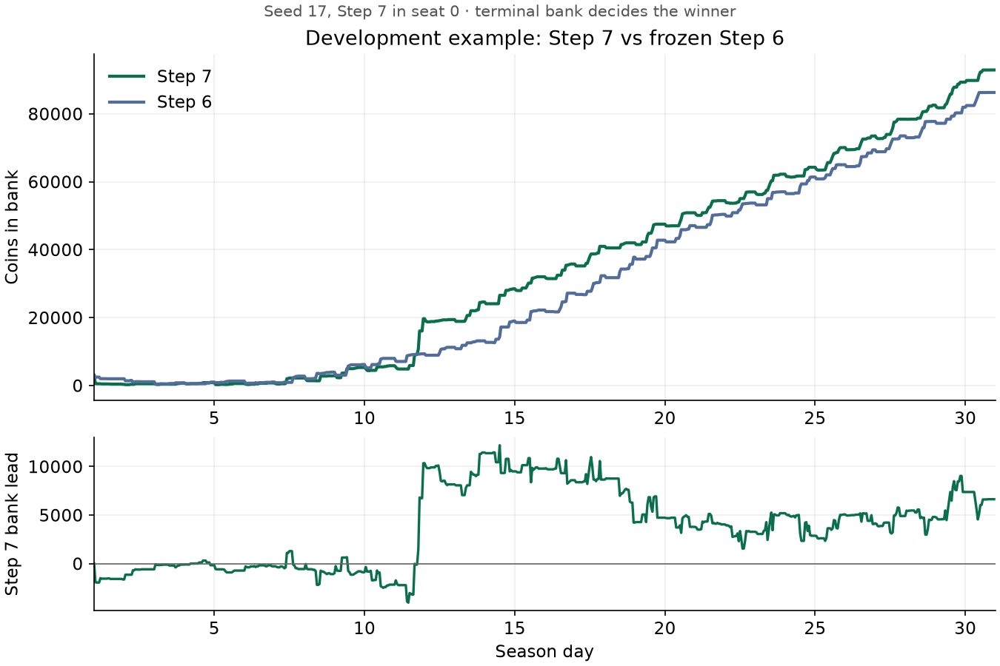

# Step 7 results: joint opening and production bundles

## Release status

**Server execution confirmed after local promotion.** The release is `artifacts/submission-step-7-v2/main.py`. Subsequently supplied ladder episodes 107666399 and 107668390 reproduce exactly and match all 719 of our decisions per game. See the [server analysis](STEP_7_SERVER_ANALYSIS.md). The original local results below retain their historical scope.

The candidate buys a joint crop/animal opening, values dated base/fertilized crop schedules, and admits crops independently of installed herd size. It also preloads the first feed before animal installation. The [implementation notes](STEP_7_OPTIMIZATION.md) connect these choices to integer activity selection, cash feasibility, opportunity cost, and endogenous market prices.

Source SHA-256: `5ec112bd59eae75b2da53b4a35754a1d9c4261a6eb35677fef0b1d231e5b7a41`.

## Fresh paired comparison

The [protocol](benchmarks/step-7-protocol.json) was frozen before seeds **8001–8030**, both seats, six opponents, and four local CPU processes per run. Candidate and frozen Step 6 face identical opponent files and seed/seat combinations: **360 games per policy, 720 total**. The simulator, configuration, runner, dependency lock, opponent hashes, and concurrency must match before comparison.

**Step 7 won 360/360 games.** Step 6 recorded 254 wins, 50 draws, and 56 losses, for a 77.50% match score. The paired score improvement is **+22.50 percentage points**, with a whole-seed 95% bootstrap interval of **+20.28 to +24.44 points**.

| Opponent | Step 7 W/D/L | Step 6 W/D/L | Step 7 mean margin | Worst Step 7 margin |
| --- | ---: | ---: | ---: | ---: |
| Cow-only livestock | 60/0/0 | 60/0/0 | +32,061.20 | +13,166 |
| Independent delayed crops | 60/0/0 | 60/0/0 | +63,120.95 | +35,199 |
| Independent early crops | 60/0/0 | 60/0/0 | +58,205.48 | +25,666 |
| Mixed melon specialist | 60/0/0 | 9/0/51 | +8,138.92 | +1,703 |
| Frozen Step 6 | 60/0/0 | 5/50/5 | +7,955.65 | +716 |
| Mixed strawberry specialist | 60/0/0 | 60/0/0 | +12,896.95 | +3,227 |


Match score is `(wins + 0.5 × draws) / games`. The interval resamples whole seeds, keeping both seats and all opponent families together. It describes this fixed internal pool. It does not estimate leaderboard rating or medal probability.

The early and delayed crop suppliers have independent code and reliably produce twelve opening melons, followed by strawberries. They are timing stress tests with weak overall earnings because they have no livestock. Mixed crop specialists and the cow control share historical source. None implements a leading player's expanding mixed farm; the resulting win rate must be interpreted with that limitation.

Across all 360 candidate games: **zero** execution errors, unplanned crop losses, escaped animals, missed feeding, duplicate crop targets, or seed overrequests. Every game ended with zero unsold shed/carried goods and unused seeds. The maximum measured candidate decision time was **0.152223 seconds**. The worst bank margin was **+716** coins; no opponent family's match score regressed.

## Why the first validation candidate was rejected

The first candidate won all 96 completed games but accumulated nine missed feeding refreshes. We stopped that run and did not run its reference comparison. Winning did not override the operational gate.

The cause was a late installation by a worker returning from crop work. The animal was placed before the day ended, but the worker still needed a shed round trip to get feed. The correction preloads feed and requires placement, feeding, and care to fit. Both a controlled-state test and the actual failing seed cover this regression.

All seeds 7001–7030 were retired, including ones not completed before the stop. The [failed protocol](benchmarks/step-7-rejected-protocol.json) and [rejection record](benchmarks/step-7-rejected.json) remain saved. The old `artifacts/submission-step-7/main.py` is explicitly marked **DO NOT SUBMIT**. It passed loader validation but failed strategy validation. The approved release path, if promoted above, is `artifacts/submission-step-7-v2/main.py`.

## Development evidence and ablations

After the installation correction, the candidate won all twenty games against Step 6 and the melon specialist on seeds 17, 43, 7002, 7004, and 7012, in both seats. These are development/regression games, not fresh validation.

The final source also played source-matched ablations on seeds 17 and 43, in both seats:

| Disabled feature | Final candidate wins | Mean bank margin |
| --- | ---: | ---: |
| Joint Day 1 opening | 4/4 | +13,518.75 |
| Fertilizer in valuation and execution | 4/4 | +5,127.25 |
| Crop area beyond eight plots | 4/4 | +1,958.75 |

These small development comparisons support the mechanisms; they are not independent estimates of final strength. Changed tile occupancy changes weed RNG consumption and can change future shops even with the same seed. We compare whole policies rather than claiming a controlled market path.



This is seed 17 with Step 7 in seat 0: final bank **92,923 versus 86,290**. The first eight melons were planted and watered on Day 1. Bank balance temporarily trails while money is invested; only terminal bank determines the winner. This illustration is not part of the fresh comparison.

## Artifact and checks

- **105 tests passed**, including full seasons, shared resources, growth schedules checked against the official engine, opening execution, and installation-day feeding.
- Ruff lint, formatting, and whitespace checks passed.
- The copied **79,170-byte** standalone file passed isolated full-season self-play through the official loader, with the repository removed from its import path.
- Both players finished `DONE`; no stderr, execution failures, unused seeds, or final shed/carried inventory.
- Maximum decision time in isolated validation: **0.080774 seconds**, below the configured one-second action limit. Local timing is not a server guarantee.
- A separate synthetic observation check substituted each leader's peak **75-asset public farm** into three of our own recorded states. Across five calls per combination, the maximum was **0.090041 seconds**. This checks rival-state processing cost; it is not a competitive game or a claim that we beat that player.
- At the original local release, no Kaggle upload had been performed. The subsequently supplied server evidence is linked above.

The [opening explanation](examples/step-7-opening.json) and [production explanation](examples/step-7-production.json) verify source hash and equality with the recorded action before presenting the forecast. The latter shows a fertilized strawberry adding a projected **1,377.8 coins** after the 100-coin seed and 155 additional wage coins; fertilizer diverted from sale is accounted for inside receipts.

The committed [benchmark evidence](benchmarks/step-7.json) contains both manifests, all 720 match records, paired statistics, operational totals, development summaries, the rejection record, and exact artifact validation. Raw replays and execution logs remain local under `artifacts/`.

## Reproduce

Use new output directories if these already exist. Historical source and generated controls are checked against the committed protocol hashes.

```bash
uv sync --locked
uv run python scripts/make_mixed_control.py --source baselines/step_6.py \
  --crops MELON --output artifacts/step-6-controls/melons.py
uv run python scripts/make_mixed_control.py --source baselines/step_6.py \
  --crops STRAWBERRY --output artifacts/step-6-controls/strawberries.py
uv run python scripts/make_livestock_control.py --source baselines/step_6.py \
  --animal COW --output artifacts/step-7-controls/cows.py
uv run python scripts/make_early_control.py --output artifacts/step-7-pool/early-crops.py
uv run python scripts/make_early_control.py --delay-sales-until 18 \
  --output artifacts/step-7-pool/delayed-crops.py

STEP7_SEEDS=(8001 8002 8003 8004 8005 8006 8007 8008 8009 8010 8011 8012 8013 8014 8015 8016 8017 8018 8019 8020 8021 8022 8023 8024 8025 8026 8027 8028 8029 8030)
STEP7_OPPONENTS=(baselines/step_6.py artifacts/step-6-controls/melons.py artifacts/step-6-controls/strawberries.py artifacts/step-7-controls/cows.py artifacts/step-7-pool/early-crops.py artifacts/step-7-pool/delayed-crops.py)
uv run python evaluate.py --agent main.py --seeds "${STEP7_SEEDS[@]}" \
  --opponents "${STEP7_OPPONENTS[@]}" --workers 4 --output artifacts/step-7-validation-v2
uv run python evaluate.py --agent baselines/step_6.py --seeds "${STEP7_SEEDS[@]}" \
  --opponents "${STEP7_OPPONENTS[@]}" --workers 4 --output artifacts/step-7-reference-v2
uv run python compare_results.py --candidate artifacts/step-7-validation-v2 \
  --reference artifacts/step-7-reference-v2 --output artifacts/step-7-paired-v2.json
uv run pytest -q
uv run python prepare_submission.py --output artifacts/submission-step-7-v2
```

The array syntax works in Bash and Zsh. The explanation tool now invokes the Step 7 planner; explaining a historical replay requires matching historical source, not the new planner.

## Upload only the approved file

```bash
kaggle competitions submit kaggriculture \
  -f /Users/ryokitano/Documents/Projects/kaggriculture/artifacts/submission-step-7-v2/main.py \
  -m "Step 7 - joint opening and production bundles - 5ec112bd59ea"
```

This command uses the installed CLI's positional competition argument, verified with `kaggle competitions submit --help`. A new upload changes the latest-two submission window. After upload, record the submission ID, source hash, and validation episode; a local pass is not a Kaggle server pass.

## Next checkpoint

Test conditional land expansion and integrated routes against an expanding mixed opponent. The present ten-animal/twelve-crop capacity still differs substantially from the 75 productive tiles seen in the leading-player replay. Early wheat harvest alternatives, a separate multi-day waiting decision, and selective maintenance remain unimplemented. The current improvement does not establish that these additional investments will be profitable.
