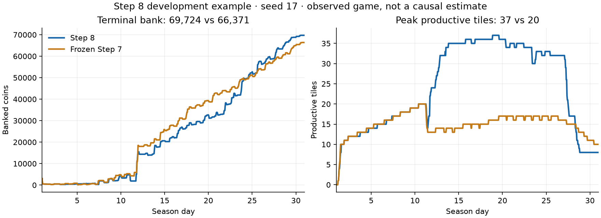

# Step 8 results: conditional expansion

## Release status

**Promoted locally and ready for Kaggle upload.** The copied artifact
`artifacts/submission-step-8/main.py` passed isolated self-play, the frozen
comparative protocol, and additional serial diagnostics of parallel timing outliers.
No Kaggle upload has been performed during this implementation.

Source SHA-256: `63dbf4381d8607cbd681f5296749f4f8af4cc37d0181f97d6b8931f6078d3f72`.

The [CO notes](STEP_8_OPTIMIZATION.md) distinguish the investment model, route
estimates, actual dispatcher, and remaining limitations. The [server analysis](STEP_7_SERVER_ANALYSIS.md)
reconciles the 84,393–41,423 win over Jaikrishna@007 and the earlier MugaBros loss.

## Evaluation protocol

The [frozen protocol](benchmarks/step-8-protocol.json) specifies seeds 9001–9030,
both seats, and six reactive opponent files. Candidate and frozen Step 7 each play
360 games with four local CPU processes. Their environment, configuration,
runner, dependency lock, seeds, seats, and opponent hashes must match before
comparison. A controller stops the candidate run on a tracked operational failure.

The pool includes independently coded expanding mixed and cow-heavy farms,
frozen Step 7, historical melon and strawberry specialists, and an independent
delayed crop supplier. The two expanding variants share their own source; they
are not two unrelated implementations. Historical specialists also share source.
The controls are not recreations of the private code of MugaBros or other leaders.

The [complete benchmark](benchmarks/step-8.json) preserves manifests, all 720
match records, operational totals, development ablation, runtime diagnostics,
and the isolated artifact report. Source and controls were unchanged throughout.

| Opponent | Step 7 W / D / L | Step 8 W / D / L |
| --- | ---: | ---: |
| Frozen Step 7 | 14 / 32 / 14 | 60 / 0 / 0 |
| Independent expanding mixed farm | 42 / 0 / 18 | 56 / 0 / 4 |
| Independent expanding dairy variant | 41 / 0 / 19 | 57 / 0 / 3 |
| Historical melon specialist | 60 / 0 / 0 | 60 / 0 / 0 |
| Historical strawberry specialist | 60 / 0 / 0 | 60 / 0 / 0 |
| Independent delayed crop supplier | 60 / 0 / 0 | 60 / 0 / 0 |
| **Total** | **277 / 32 / 51** | **353 / 0 / 7** |

Counting a draw as half a win, match score increases from **81.39% to 98.06%**.
The paired difference is **+16.67 percentage points**, with a whole-seed bootstrap
95% interval of **+11.67 to +21.67 points** (30 seed blocks, 10,000 resamples).
Every class improved or tied its prior match score. The candidate's average
bank was 84,781.61 and average match margin was +24,897.71; against Step 7 alone,
the average margin was +9,834.77. Coin margins are diagnostic, not rating points.

Across the 360 candidate games, execution errors, unplanned crop losses, escaped
animals, missed feeding, duplicate crop targets, seed overrequests, final
shed/carried goods, and unused seeds were all zero. These are the tracked
contracts, not a proof that every command or economic choice was optimal.

Every candidate game bought exactly one extra quadrant for 1,000 coins and
reached 32–39 productive tiles. The code permits 75 owned tiles, but these games
only demonstrate operations on 50 owned tiles. The capacity gain was deliberately
bounded; land ownership alone is not a measure of throughput.

The seven losses were all against expanding opponents, with deficits from 98 to
7,949 coins. They had no tracked candidate operational failure. The controls
harvested 174–178 strawberries in those games versus our 48–150, while our
recorded hiring costs were 7,174–8,065 versus their 3,300–3,410. This motivates
better production timing and staffing economics; it does not identify a causal
fix or justify tuning on these validation seeds. The [CO notes](STEP_8_OPTIMIZATION.md)
show a concrete gap between forecast and executed staffing.

This evidence describes the internal pool, not leaderboard rating or medal
probability. The controls have narrower policies than unknown ladder rivals.
Any future strategy change requires new validation seeds.

## Development and mechanism checks

The frozen candidate won all 32 development games on seeds 17, 43, 83, and 137,
in both seats, against Step 7, the expanding mixed farm, the melon specialist,
and a source-matched version with land disabled. No candidate execution error,
unplanned crop loss, missed feeding, escape, duplicate target, seed overrequest,
or terminal shed/carried inventory/unused seed was recorded in those games.

The land-disabled ablation retains the other Step 8 changes. Step 8 won 8/8 with
an average margin of **3,344 coins**. This is development evidence for the feature,
not an untouched estimate of its effect. Policy changes can alter later shop draws
through weed RNG consumption, so identical seeds do not fix every future event.

Several earlier prototypes were rejected despite winning games. Their failures
included worker reassignment after harvest or animal placement and unnecessary
return allowances that caused deadline tasks to switch between workers. The
final implementation preserves the tested dispatcher, keeps livestock on shared
routes, finishes installation feeding locally, and gives completed animal routes
no fictitious return obligation when workers switch to crops.



The illustrated seed-17 game ends **69,724 versus 66,371**, with peak productive
areas of **37 versus 20 tiles**. Exact transaction resimulation matches all states
and reconciles both banks. Neither side has storage overflow in this example.
The [source-matched expansion explanation](examples/step-8-expansion.json) shows
the Day 11 decision to buy land and twelve strawberry seeds for 2,200 coins.

## Artifact and engineering checks

- 113 tests passed; Ruff lint, formatting, and whitespace checks passed.
- The 92,579-byte single-file artifact passed isolated full-season self-play with
  the repository excluded from its import path.
- Both players finished DONE with no stderr, failures, unused seeds, or final
  shed/carried inventory. Maximum isolated decision time was 0.176968 seconds.
- The parallel tournament's maximum was **1.466482 seconds**, with two games
  exceeding the nominal one-second allowance. The pinned engine also permits
  remaining overage time; neither game timed out. The original timings are retained.
- All six games with a parallel maximum above 0.5 seconds were rerun serially in
  an isolated process using the exact artifact. Their final banks matched,
  every game completed without stderr or failure, and the maximum decision was
  **0.299485 seconds**. The slowdown did not reproduce serially; contention is a
  plausible explanation, not a proven cause. These are runtime diagnostics,
  not six additional independent competitive observations.
- Local timing is not a guarantee about server hardware. Actual Kaggle validation
  remains a separate step.
- The replay auditor now also accepts local simulator metadata without inventing
  a server episode ID. The local example was fully resimulated after this change.

## Remaining scope

This checkpoint keeps ten animal sites and three crop species. It admits at most
three owned quadrants; owning 75 tiles does not imply all can be serviced profitably.
The route-based wage estimate and real dispatcher are not identical optimizers.
Matching forecast staffing to actual dispatch, selective maintenance, advanced
sale timing, additional harvest alternatives, and broader opponent modeling
remain later steps. Step 9 should prioritize production timing and the staffing
cost discrepancy before further increases in farm size.

## Reproduce the frozen comparison

Use a clean checkout at this release. The following creates the ignored controls;
existing files are intentionally not overwritten. Their bytes were checked
against every corresponding hash in the protocol.

```bash
uv run python scripts/make_mixed_control.py --source baselines/step_6.py \
  --crops MELON --output artifacts/step-6-controls/melons.py
uv run python scripts/make_mixed_control.py --source baselines/step_6.py \
  --crops STRAWBERRY --output artifacts/step-6-controls/strawberries.py
uv run python scripts/make_early_control.py --delay-sales-until 18 \
  --output artifacts/step-7-pool/delayed-crops.py
uv run python - <<'PY'
from pathlib import Path
p = Path('artifacts/step-8-controls/expanding-dairy.py')
p.parent.mkdir(parents=True, exist_ok=True)
with p.open('x') as f:
    f.write(Path('opponents/expanding_mixed.py').read_text().replace(
        'MILK_COWS = 2', 'MILK_COWS = 4'))
PY
uv run python - <<'PY'
import hashlib, json, subprocess, sys
from pathlib import Path
p = json.loads(Path('docs/benchmarks/step-8-protocol.json').read_text())
for path, expected in {
    'main.py': p['candidate_sha256'],
    'evaluate.py': p['runner_sha256'],
    'uv.lock': p['lock_sha256'],
    **p['opponents'],
}.items():
    assert hashlib.sha256(Path(path).read_bytes()).hexdigest() == expected, path
for label, agent in [('candidate', 'main.py'), ('reference', 'baselines/step_7.py')]:
    subprocess.run([
        sys.executable, 'evaluate.py', '--agent', agent,
        '--seeds', *map(str, p['seeds']), '--opponents', *p['opponents'],
        '--workers', '4', '--output', f'artifacts/step-8-reproduction-{label}',
    ], check=True)
PY
uv run python compare_results.py \
  --candidate artifacts/step-8-reproduction-candidate \
  --reference artifacts/step-8-reproduction-reference \
  --output artifacts/step-8-reproduction-comparison.json
```

Repeating these deterministic games verifies reproduction; it adds no independent
competitive evidence. New policy tuning requires a new validation seed set.
